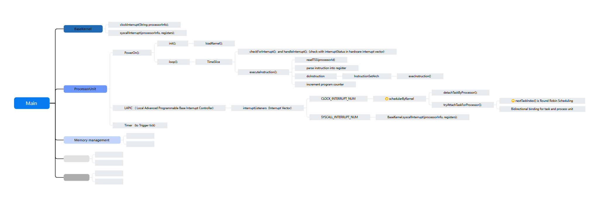

# mutil-cpu-processor-emulation

## 2025-03-25 virtual machine system architecture

 ### 2025-03-25

 - -> build clock interrupt
 - -> build cpu interface for base kernel
 - -> build scheduler of kernel
 - -> build ISA for CPU
 - -> add lock for multi-cpu-core scene
 - -> add soft interrupt
 - -> add program counter
 - -> add ksoftirqd 

 ### coming soon
 - -> page table